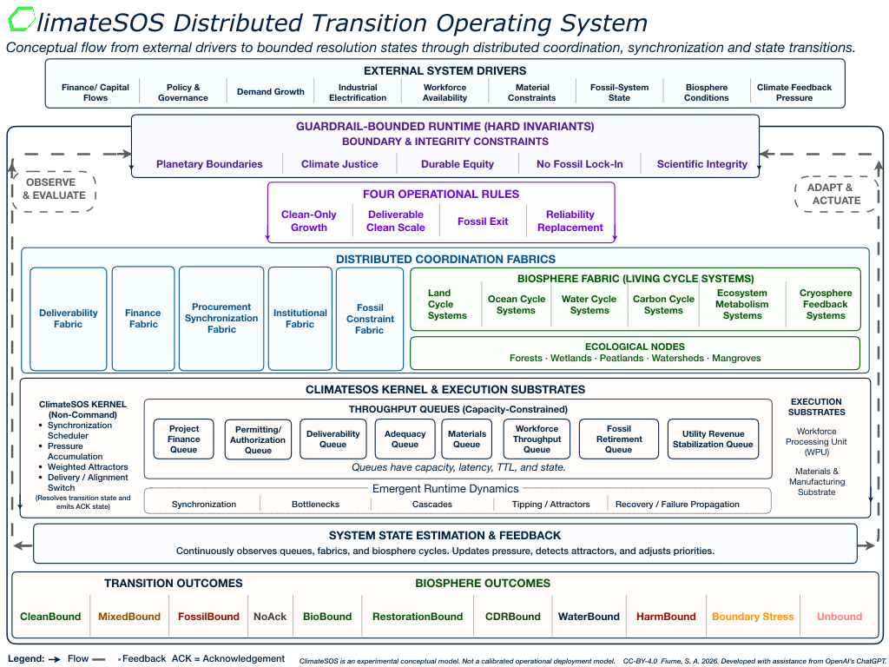
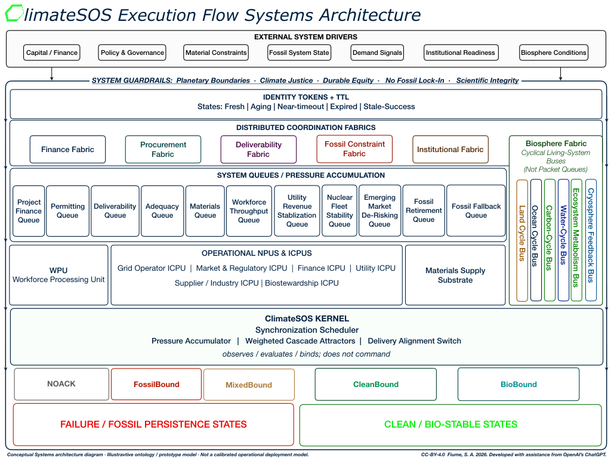

# ClimateSOS

> A prototype transition-modeling application with distributed operating-system-inspired internals for analyzing whether clean-energy deployment, fossil retirement, reliability replacement, and biosphere stabilization can synchronize under real-world constraints.

---

# Overview

ClimateSOS is an experimental systems architecture and executable modeling framework to better understand the clean-energy transition as a distributed synchronization problem rather than a purely policy, market, or technology problem.

The project's home is **https://www.autofracture.com/netzeroasap**. For a full treatment of the problem scope, see the living source documentation **2030s Net Zero Playbook**: **https://bit.ly/NZpbk**.

The playbook frames the earliest plausible operational net-zero window as a constraint-mapped systems problem: clean growth must synchronize with deliverability, reliability replacement, fossil exit, finance, workforce mobilization, and biosphere restoration.

Stable PDF releases are also archived in this repository for easier viewing and versioned citation.

The project coalesced around the realization that:

> clean growth alone does not guarantee fossil displacement.

Large-scale decarbonization succeeds only when multiple constrained systems move together:

- clean generation
- transmission and deliverability
- storage and adequacy
- workforce throughput
- capital allocation
- fossil retirement
- industrial conversion
- biosphere restoration

ClimateSOS models these interactions using concepts drawn from:

- distributed systems
- operating-system architecture
- queue theory
- synchronization logic
- state-transition systems
- nonlinear dynamics
- complex adaptive systems
- ecological systems thinking
- resilience and cascade modeling
- Earth-system science
- planetary-boundary frameworks

Instead of treating the transition primarily as a stakeholder map or policy roadmap, ClimateSOS treats it as:

> a constrained distributed execution environment with synchronization requirements, bottlenecks, queues, tipping states, fallback attractors, and biosphere boundary conditions.

---

## Why the name ClimateSOS?

The name has two meanings.

**SOS** reflects the project’s emergency-use purpose: helping expose failure modes in distributed, coordinated, sequenced transition pathways before those failures harden into fossil lock-in, delay, or biosphere harm.

**OS** reflects the project’s distributed operating-system-inspired architecture. ClimateSOS models transition pathways as guardrail-bounded processes moving through flows, queues, fabrics, constraints, state transitions, fallback states, and validity checks.

ClimateSOS is not a literal operating system and does not control real-world infrastructure or institutions. It does not allocate capital, authorize permits, operate grids, manage assets, direct institutions, or make policy. It is a modeling and reasoning framework for inspecting whether proposed transition pathways remain synchronized, bounded, and valid.

---

# Architecture Diagrams

---

# Key Architectural Concepts

## Fabrics

Fabrics coordinate distributed system behavior.

Current major fabrics include:

- Finance Fabric
- Deliverability Fabric
- Procurement Synchronization Fabric
- Fossil Constraint Fabric
- Political / Institutional Fabric
- Biosphere Fabric

The Biosphere chapter 11 and the AI project guardrails in Appendix O direct the implementation of the Biosphere Fabric systems. See those sections for the underlying rationale and implementation constraints.

---

## Identity Tokens & Resulting States

After an identity token passes through a function, queue, switch, or attractor, it can resolve to the following possible states.

| Identity | Resulting State |
|---|---|
| Large Flexible Load | CleanBound |
| Fossil Backup Expansion | FossilBound |
| Delayed Transmission Corridor | NoAck |

---

## Attractor Patterns

ClimateSOS models recurring nonlinear system behaviors as attractors.

### Clean Attractors
- procurement cascades
- clean-demand synchronization
- supply-chain conversion

### Fossil Attractors
- reliability panic
- bailout cascades
- fallback persistence
- capacity-market entrenchment

---

# The Biosphere Layer

ClimateSOS treats the biosphere differently from technical fabrics.

Technical systems behave primarily through:
- packets
- queues
- synchronization
- routing

The biosphere behaves through:
- cycles
- metabolism
- resilience
- degradation
- recovery

The Biosphere Fabric includes:
- land-cycle systems
- ocean-cycle systems
- watershed systems
- peatlands
- forests
- wetlands
- cryosphere feedback systems

The Biosphere Fabric also represents ecological networks, ecosystem interdependence, and trophic interdependence: the coupled relationships among habitats, niches, organisms, dependent species, nutrient cycles, water flows, food-web dynamics, and ecosystem functions.

This matters because biosphere stability is carried by both organisms and habitats, as well as by ecological relationships, interdependence, nutrient cycles, water flows, and ecosystem functions that operate together across living systems and their interlinkages.

The architecture treats biosphere integrity as a boundary condition, not merely a carbon-removal target.

---

## Guardrails and AI governance

ClimateSOS is governed by the [ClimateSOS Foundational Charter](docs/foundationalcharter.md), which defines safeguards and validity conditions for the project and its derivative tools. From inception, ClimateSOS has been developed within an operating envelope of planetary, justice, biosphere, evidence, and AI-accountability guardrails.

The Charter makes that operating envelope explicit. It defines what the project is for, what it must not be used to justify, how it must avoid committing harm to people, communities, ecosystems, and future generations, and what conditions a pathway must satisfy before it can be treated as valid within ClimateSOS.

The Charter treats technical success as insufficient on its own. For example, a pathway that appears to reduce emissions, accelerate deployment, improve efficiency, or increase AI-system performance is not fully valid if those gains violate planetary boundaries, degrade biosphere integrity, avoid committing harm to people or communities, weaken accountable human judgment, obscure fossil persistence, hide lifecycle harms, or reproduce exploitative, extractive, or sacrifice-zone dynamics.

ClimateSOS provides an example framework for *AI safety*, *AI ethics*, and *AI governance* in guardrail-bounded climate-transition reasoning. It is not an AI agent, autonomous planner, or decision-making authority. It is an AI-assisted transition-reasoning project informed by the Charter, and it could inform future AI-supported pathway-evaluation tools.

Those tools require clear safeguards:

- alignment with planetary boundaries, biosphere integrity, climate justice, repair, remedy, and long-term stewardship
- protection of human rights, agency, community control, privacy, dignity, and capacity for flourishing
- no sole delegation to AI systems
- no command authority over real-world infrastructure, policy, finance, or communities
- traceable and contestable assumptions, claims, sources, uncertainties, and outputs
- fitness-for-purpose review, domain competence, and accountable human judgment
- misuse prevention against fossil delay, greenwashing, burden-shifting, governance capture, and unaccountable automation
- lifecycle and value-chain integrity so harms are not hidden, outsourced, or displaced
- AI load discipline so AI growth does not undermine clean-only growth or fossil phaseout

The ClimateSOS repository includes AI-related tags because AI-assisted analysis requires guardrails, accountability, traceability, and limits on automated authority.

---

# Conceptual Influences

ClimateSOS draws conceptual inspiration from multiple fields, including:

- distributed operating systems
- synchronization and queueing theory
- nonlinear dynamics
- complex adaptive systems
- systems dynamics
- ecological systems thinking
- resilience and cascade modeling
- Earth-system and biosphere science
- planetary-boundary frameworks
- infrastructure transition analysis

ClimateSOS also draws from ecoliteracy and ecological systems thinking, especially the idea that human systems must be understood within the organizing principles and limits of living systems. The term “ecoliteracy” is commonly associated with Fritjof Capra and the Center for Ecoliteracy.

The framework blends technical systems architecture with ecological and planetary systems reasoning, treating the climate transition as a constrained distributed execution problem occurring within coupled human and biosphere systems.

---

# Attribution

**Author / maintainer:** Shannon A. Fiume (@safiume)  
**License:** Creative Commons Attribution 4.0 International (CC BY 4.0), 2026

ClimateSOS was conceived, researched, directed, architected, and developed by Shannon A. Fiume through an iterative human–AI collaboration. OpenAI’s ChatGPT provided AI-assisted research support, drafting, code-generation, implementation assistance, and systems design iteration under Shannon’s direction.  

---

# Status Notice

This repository is experimental research software and conceptual systems architecture.

Nothing here should be interpreted as:
- operational infrastructure control software,
- investment advice,
- policy instruction,
- or predictive certainty.

The framework exists to explore synchronization dynamics, bottlenecks, attractor behavior, biosphere coupling, and transition-state dynamics in accelerated decarbonization pathways.
