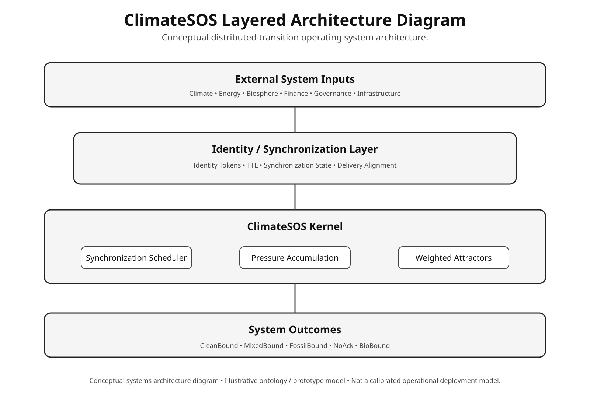
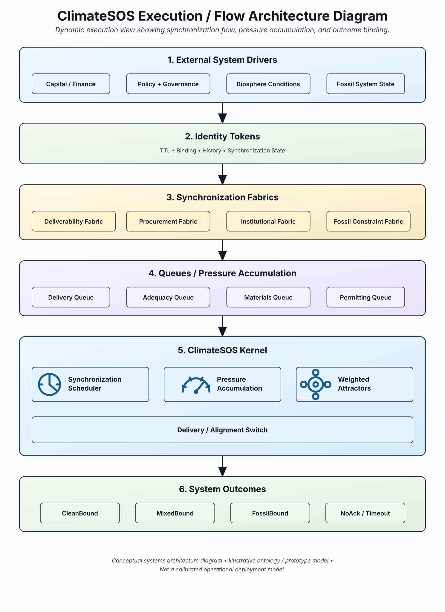

# ClimateSOS

> A distributed transition operating system for synchronizing clean-energy transition, fossil retirement, and biosphere stabilization under real-world constraints.

---

# Read the defining playbook

The broader problem scope is defined in the live **2030s Net Zero Playbook**:

## https://bit.ly/NZpbk

The playbook frames the earliest plausible operational net-zero window as a constraint-mapped systems problem: clean growth must synchronize with deliverability, reliability replacement, fossil exit, finance, workforce mobilization, and biosphere restoration.

Stable PDF releases can also be archived in this repository for versioned citation.

---

# Architecture Diagrams

## ClimateSOS Layered Architecture Diagram

## ClimateSOS Synchronization Flow Diagram

---

# Overview

ClimateSOS is an experimental systems architecture and executable modeling framework for understanding the clean-energy transition as a distributed synchronization problem rather than a purely policy, market, or technology problem.

The project emerged from the realization that:

> clean growth alone does not guarantee fossil displacement.

Large-scale decarbonization succeeds only when multiple constrained systems move together:

- clean generation
- transmission and deliverability
- storage and adequacy
- workforce throughput
- capital allocation
- fossil retirement
- industrial conversion
- biosphere restoration

ClimateSOS models these interactions using concepts drawn from:

- distributed systems
- operating-system architecture
- queue theory
- synchronization logic
- state-transition systems
- nonlinear dynamics
- complex adaptive systems
- ecological systems thinking
- resilience and cascade modeling
- Earth-system science
- planetary-boundary frameworks

Instead of treating the transition primarily as a stakeholder map or policy roadmap, ClimateSOS treats it as:

> a constrained distributed execution environment with synchronization requirements, bottlenecks, queues, tipping states, fallback attractors, and biosphere boundary conditions.

---

# Key Architectural Concepts

## Fabrics

Fabrics coordinate distributed system behavior.

Current major fabrics include:

- Finance Fabric
- Deliverability Fabric
- Procurement Synchronization Fabric
- Fossil Constraint Fabric
- Political / Institutional Fabric
- Biosphere Fabric

The architecture and biosphere-layer rationale are discussed further in the playbook’s systems architecture sections, including Chapter 11 and Appendix O.

These sections explain why synchronization, ecological coupling, and biosphere stability are treated as first-class architectural constraints rather than downstream externalities.

---

## Identity Tokens & Resulting States

After an identity token passes through a function, queue, switch, or attractor, it may resolve into a resulting state.

| Identity | Resulting State |
|---|---|
| Large Flexible Load | CleanBound |
| Fossil Backup Expansion | FossilBound |
| Delayed Transmission Corridor | NoAck |

---

## Attractor Patterns

ClimateSOS models recurring nonlinear system behaviors as attractors.

### Clean Attractors
- procurement cascades
- clean-demand synchronization
- supply-chain conversion

### Fossil Attractors
- reliability panic
- bailout cascades
- fallback persistence
- capacity-market entrenchment

---

# The Biosphere Layer

ClimateSOS treats the biosphere differently from technical fabrics.

Technical systems behave primarily through:
- packets
- queues
- synchronization
- routing

The biosphere behaves through:
- cycles
- metabolism
- resilience
- degradation
- recovery

The Biosphere Fabric includes:
- land-cycle systems
- ocean-cycle systems
- watershed systems
- peatlands
- forests
- wetlands
- cryosphere feedback systems

The Biosphere Fabric also represents ecological networks, ecosystem interdependence, and trophic interdependence: the coupled relationships among habitats, niches, organisms, dependent species, nutrient cycles, water flows, food-web dynamics, and ecosystem functions.

This matters because biosphere stability is carried by both organisms and habitats, and also by the ecological relationships, interdependence, nutrient cycles, water flows, and ecosystem functions that operate together across living systems and their interlinkages.

The architecture treats biosphere integrity as a boundary condition, not merely a carbon-removal target.

---

# Conceptual Influences

ClimateSOS draws conceptual inspiration from multiple fields, including:

- distributed operating systems
- synchronization and queueing theory
- nonlinear dynamics
- complex adaptive systems
- systems dynamics
- ecological systems thinking
- resilience and cascade modeling
- Earth-system and biosphere science
- planetary-boundary frameworks
- infrastructure transition analysis

ClimateSOS also draws from ecoliteracy and ecological systems thinking, especially the idea that human systems must be understood within the organizing principles and limits of living systems. The term “ecoliteracy” is commonly associated with Fritjof Capra and the Center for Ecoliteracy.

The framework blends technical systems architecture with ecological and planetary systems reasoning, treating the climate transition as a constrained distributed execution problem occurring within coupled human and biosphere systems.

---

# Attribution

ClimateSOS was conceived, researched, directed, architected, and developed by Shannon A. Fiume through an iterative human–AI collaboration. OpenAI’s ChatGPT provided AI-assisted research support, drafting, code-generation, implementation assistance, and systems-design iteration under Shannon’s direction.

---

# Status Notice

This repository is experimental research software and conceptual systems architecture.

Nothing here should be interpreted as:
- operational infrastructure control software,
- investment advice,
- policy instruction,
- or predictive certainty.

The framework exists to explore synchronization dynamics, bottlenecks, attractor behavior, biosphere coupling, and transition-state dynamics in accelerated decarbonization pathways.
